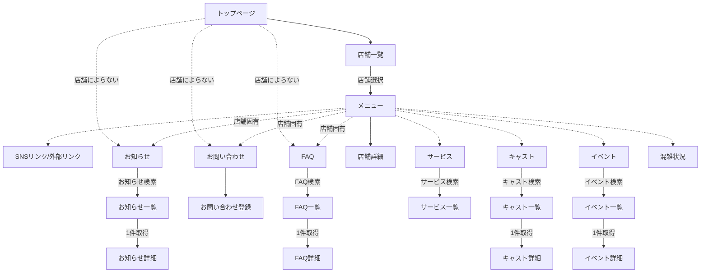
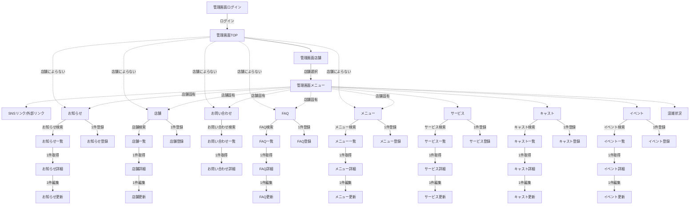

# 成果物：2.猫カフェシステム(画面遷移図)
====

## Screen Transition Diagram
+ Screen(画面)
+ Transition(遷移)
+ Diagram(図)

## 画面遷移図

下記のシーケンス図は [Mermaid](https://mermaidjs.github.io/) を使用しています。  
VsCodeにて描画しているものをスクショしています。  
Macでのスクショ方法は「shift + command + 4」です。  

### ポータルサイト




```markdown
TOP: トップ
C: お知らせ
　　C1: お知らせ一覧
　　C2: お知らせ詳細
D: 店舗
　　D1: 店舗一覧
　　D2: 店舗詳細
E: お問い合わせ
　　E3: お問い合わせ登録
F: FAQ
　　F1: FAQ一覧
　　F2: FAQ詳細
G: メニュー
I: サービス
　　I1: サービス一覧
J: キャスト
　　J1: キャスト一覧
　　J2: キャスト詳細
M: イベント
　　M1: イベント一覧
　　M2: イベント詳細
N: 混雑状況
O: SNSリンク/外部リンク
```

### 管理システム




```markdown
ADMIN_TOP: 管理画面TOP
ADMIN_LOGIN: 管理画面ログイン
ADMIN_TENPO: 管理画面店舗
ADMIN_MENU: 管理画面メニュー
C: お知らせ
  C1: お知らせ一覧
  C2: お知らせ詳細
  C3: お知らせ登録
  C4: お知らせ更新
D: 店舗
  D1: 店舗一覧
  D2: 店舗詳細
  D3: 店舗登録
  D4: 店舗更新
E: お問い合わせ
  E1: お問い合わせ一覧
  E2: お問い合わせ詳細
F: FAQ
  F1: FAQ一覧
  F2: FAQ詳細
  F3: FAQ登録
  F4: FAQ更新
G: メニュー
  G1: メニュー一覧
  G2: メニュー詳細
  G3: メニュー登録
  G4: メニュー更新
I: サービス
  I1: サービス一覧
  I2: サービス詳細
  I3: サービス登録
  I4: サービス更新
J: キャスト
  J1: キャスト一覧
  J2: キャスト詳細
  J3: キャスト登録
  J4: キャスト更新
M: イベント
  M1: イベント一覧
  M2: イベント詳細
  M3: イベント登録
  M4: イベント更新
N: 混雑状況
O: SNSリンク/外部リンク
Q: 管理画面用ユーザー
  Q1: ユーザー一覧
  Q2: ユーザー詳細
  Q3: ユーザー登録
  Q4: ユーザー更新
```