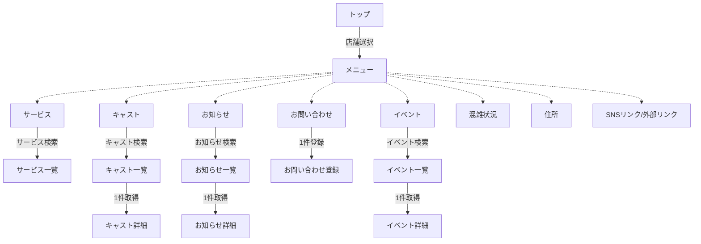
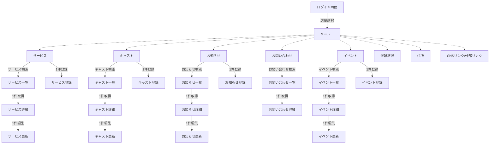

# 成果物：猫カフェシステム(方式設計)
====

## シーケンス図

下記は [Mermaid](https://mermaidjs.github.io/) を使用しています。  
VsCodeのアプリにて描画しているものをスクショしています。  
Macでのスクショ方法は「shift + command + 4」です。  

### ホームページ




```markdown
A: トップ
B: メニュー
C: サービス
　　C1: サービス一覧
D: キャスト
　　D1: キャスト一覧
　　D2: キャスト詳細
E: お知らせ
　　D1: お知らせ一覧
　　E2: お知らせ詳細
F: お問い合わせ
　　F1: お問い合わせ登録
G: イベント
　　G1: イベント一覧
　　G2: イベント詳細
H: 混雑状況
I: 住所
J: SNSリンク/外部リンク
```

### 管理システム




```markdown
A: ログイン画面
B: メニュー
C: サービス
  C1: サービス一覧
  C2: サービス詳細
  C3: サービス登録
  C4: サービス更新
D: キャスト
  D1: キャスト一覧
  D2: キャスト詳細
  D3: キャスト登録
  D4: キャスト更新
E: お知らせ
  E1: お知らせ一覧
  E2: お知らせ詳細
  E3: お知らせ登録
  E4: お知らせ更新
F: お問い合わせ
  F1: お問い合わせ一覧
  F2: お問い合わせ詳細
G: イベント
  G1: イベント一覧
  G2: イベント詳細
  G3: イベント登録
  G4: イベント更新
H: 混雑状況
I: 住所
J: SNSリンク/外部リンク
```