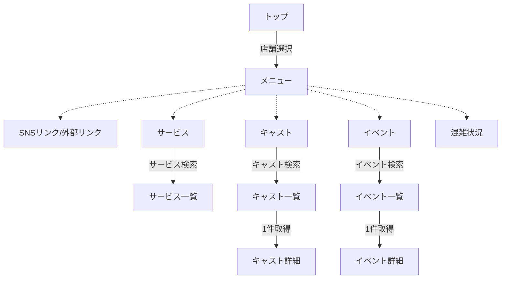
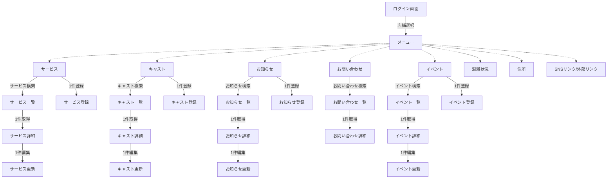

# 成果物：猫カフェシステム(機能一覧設計)
====

## 機能一覧

```markdown
A: 管理画面ログイン

C: お知らせ
D: 店舗選択
E: お問い合わせ
F: FAQ

H: メニュー
I: サービス
J: キャスト

M: イベント
N: 混雑状況
O: SNSリンク/外部リンク
```

## 画面遷移図

下記のシーケンス図は [Mermaid](https://mermaidjs.github.io/) を使用しています。
VsCodeにて描画しているものをスクショしています。
Macでのスクショ方法は「shift + command + 4」です。  

### ホームページ




```markdown
B: トップ
C: お知らせ
　　C1: お知らせ一覧
　　C2: お知らせ詳細
D: 店舗選択
　　D1: 店舗一覧
　　D2: 店舗詳細
E: お問い合わせ
　　E1: お問い合わせ登録
F: FAQ
　　F1: FAQ一覧
　　F2: FAQ詳細
H: メニュー
I: サービス
　　I1: サービス一覧
J: キャスト
　　J1: キャスト一覧
　　J2: キャスト詳細
M: イベント
　　M1: イベント一覧
　　M2: イベント詳細
N: 混雑状況
O: SNSリンク/外部リンク
```

### 管理システム




```markdown
A: ログイン画面
B: メニュー
C: サービス
  C1: サービス一覧
  C2: サービス詳細
  C3: サービス登録
  C4: サービス更新
D: キャスト
  D1: キャスト一覧
  D2: キャスト詳細
  D3: キャスト登録
  D4: キャスト更新
E: お知らせ
  E1: お知らせ一覧
  E2: お知らせ詳細
  E3: お知らせ登録
  E4: お知らせ更新
F: お問い合わせ
  F1: お問い合わせ一覧
  F2: お問い合わせ詳細
G: イベント
  G1: イベント一覧
  G2: イベント詳細
  G3: イベント登録
  G4: イベント更新
H: 混雑状況
I: 住所
J: SNSリンク/外部リンク
```

## API一覧

```markdown
A: 店舗
  A1: 店舗一覧取得API
    利用: ○ , □
  A2: 店舗詳細取得API
    利用: □  
  A3: 店舗登録API
    利用: □
  A4: 店舗更新API
    利用: □
  A5: 店舗削除API
    利用: □
B: メニュー
  B1: メニュー一覧取得API
    利用: ○ , □
  B2: メニュー詳細取得API
    利用: □
  B3: メニュー登録API
    利用: □
  B4: メニュー更新API
    利用: □
  B5: メニュー削除API
    利用: □
C: サービス
  C1: サービス一覧取得API
    利用: ○ , □
  C2: サービス詳細取得API
    利用: ○ , □
  C3: サービス登録API
    利用: □
  C4: サービス更新API
    利用: □
  C5: サービス削除API
    利用: □
D: キャスト
  D1: キャスト一覧取得API
    利用: ○ , □
  D2: キャスト詳細取得API
    利用: ○ , □
  D3: キャスト登録API
    利用: □
  D4: キャスト更新API
    利用: □
  D5: キャスト削除API
    利用: □
E: お知らせ
  E1: お知らせ一覧取得API
    利用: ○ , □
  E2: お知らせ詳細取得API
    利用: ○ , □
  E3: お知らせ登録API
    利用: □
  E4: お知らせ更新API
    利用: □
  E5: お知らせ削除API
    利用: □
F: お問い合わせ
  F1: お問い合わせ一覧取得API
    利用: ○ , □
  F2: お問い合わせ詳細取得API
    利用: □
  F1: お問い合わせ登録API
    利用: ○
G: イベント
  G1: イベント一覧取得API
    利用: ○ , □
  G2: イベント詳細取得API
    利用: ○ , □
  G3: イベント登録API
    利用: □
  G4: イベント更新API
    利用: □
  G5: イベント削除API
    利用: □
Z: 画像アップロード
    利用: □
```

○：ホームページ
□：管理システム